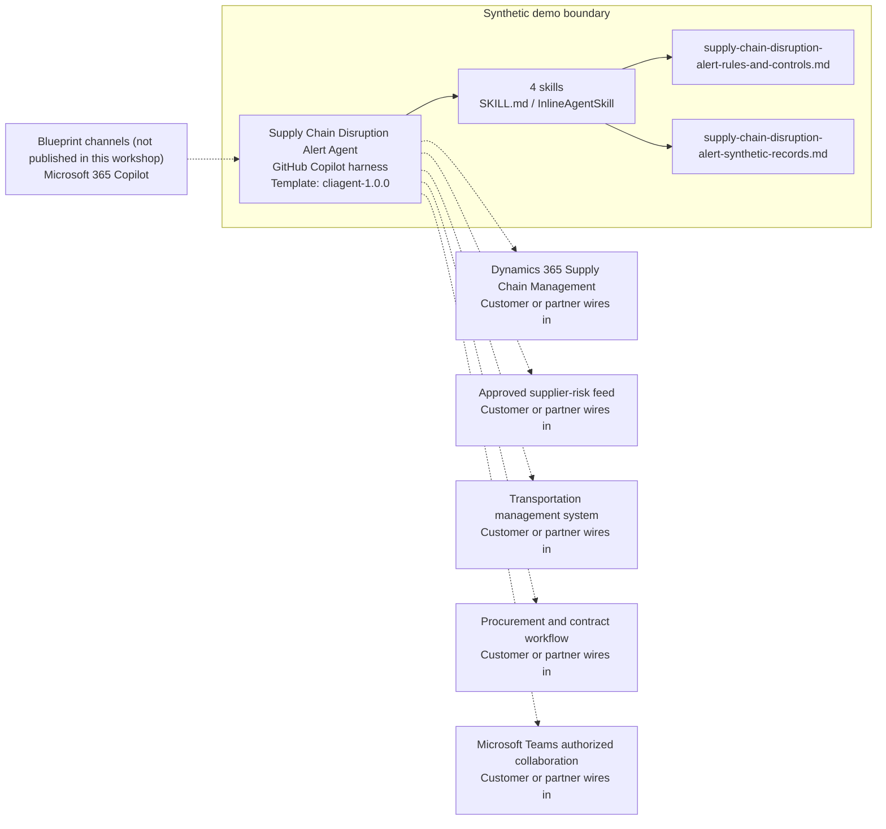

<!-- Generated by tools/build_solution_runbooks.py. Do not edit; change the sources and regenerate. -->

# Supply Chain Disruption Alert Agent — Architecture

## Solution Architecture

### Logical architecture and trust boundary

Solid: synthetic design. Dashed: unwired customer systems; channels unpublished.

## Component Responsibilities

| Operation | Capability | Purpose | Owner |
| --- | --- | --- | --- |
| disruption_dashboard | Active disruption brief | Summarizes synthetic events, routes, SKUs, delay, and modeled exposure. | Template |
| risk_assessment | Route risk explanation | Explains synthetic geopolitical, weather, infrastructure, labor, regulatory, and financial factors. | Template |
| mitigation_plan | Approval-gated mitigation scenario | Compares response actions and costs without changing a purchase order, shipment, supplier, or inventory position. | Template |
| supplier_alternatives | Supplier due-diligence candidates | Presents synthetic supplier evidence without qualification, contracting, activation, or ordering. | Template |

| Runtime reference | Recorded value |
| --- | --- |
| Portable implementation | [supply_chain_disruption_alert_agent.py](../../agents/@aibast-agents-library/retail_cpg_stacks/supply_chain_disruption_alert_stack/supply_chain_disruption_alert_agent.py) |
| Expected tool | supply-chain-disruption-alert-agent |
| Source SHA-256 (short) | ad921fdd2417 |

## Data Contract

Approve field meaning, usage and retention before replacing synthetic examples.

| Entity | Fields the template uses | Used by | Customer system of record | Sensitivity |
| --- | --- | --- | --- | --- |
| SUPPLY_ROUTES | name; origin; destination; transport_mode; transit_days; carriers; annual_volume_teu; annual_value_usd; categories; current_status; reliability_score | disruption_dashboard; risk_assessment | Transportation management system | Commercial route, carrier and volume data; restrict to operations roles. |
| DISRUPTION_EVENTS | title; type; severity; affected_routes; start_date; estimated_resolution; delay_days; affected_skus; estimated_revenue_impact; description; status | disruption_dashboard; mitigation_plan | Customer or partner maps | Operational and revenue-impact data; modeled impacts are not forecasts. |
| RISK_SCORES | overall_risk; geopolitical; weather; infrastructure; labor; regulatory; financial | risk_assessment | Approved supplier-risk feed | Route risk assessments; synthetic scores do not predict supplier default. |
| MITIGATION_PLAYBOOKS | label; immediate_actions; short_term_actions; long_term_actions; estimated_mitigation_cost; risk_reduction_pct | mitigation_plan | Customer or partner maps | Internal operating playbooks; options are drafts, not approved actions. |
| ALTERNATIVE_SUPPLIERS | name; location; lead_time_days; quality_rating; capacity_units_monthly; price_premium_pct; certifications; min_order_qty | supplier_alternatives | Customer or partner maps | Commercial supplier data; candidates are for due diligence, not awards. |

## Integration Points

**State: Not connected in the template.**

| System | Purpose | Skills that need it | Access | Template provides | Customer or partner wires in |
| --- | --- | --- | --- | --- | --- |
| Dynamics 365 Supply Chain Management | Governed operational data for disruption review. | supply-chain-disruption-alert-disruption-dashboard; supply-chain-disruption-alert-mitigation-plan; supply-chain-disruption-alert-supplier-alternatives | read | Operation contracts backed by fictional records; no live connection or system write. | [Wiring procedure](3.Runbook.md#step-3-1-integrate-dynamics-365-supply-chain-management) |
| Approved supplier-risk feed | Least-privilege risk evidence for route factor scores. | supply-chain-disruption-alert-risk-assessment; supply-chain-disruption-alert-disruption-dashboard | read | Fixed factor scores and risk bands as synthetic evidence. | [Wiring procedure](3.Runbook.md#step-3-2-integrate-approved-supplier-risk-feed) |
| Transportation management system | Route and shipment state. | supply-chain-disruption-alert-disruption-dashboard; supply-chain-disruption-alert-risk-assessment; supply-chain-disruption-alert-mitigation-plan | read | Route records and status; no reroute, dispatch or shipment change. | [Wiring procedure](3.Runbook.md#step-3-3-integrate-transportation-management-system) |
| Procurement and contract workflow | Authorized supplier activation, contracting and purchase-order changes. | supply-chain-disruption-alert-supplier-alternatives; supply-chain-disruption-alert-mitigation-plan | write | Due-diligence candidates and draft options; no action tool. | [Wiring procedure](3.Runbook.md#step-3-4-integrate-procurement-and-contract-workflow) |
| Microsoft Teams authorized collaboration | Authorized review collaboration. | supply-chain-disruption-alert-disruption-dashboard; supply-chain-disruption-alert-mitigation-plan | write | Review-ready evidence; no alert, message, approval or notification tool. | [Wiring procedure](3.Runbook.md#step-3-5-integrate-microsoft-teams-authorized-collaboration) |

## Identity and Permissions

| Template default | Customer or partner decision |
| --- | --- |
| Authentication: Microsoft Entra ID authentication; the customer selects the supported mode for the intended operations channel. | Confirm tenant, permitted identities and authentication enforcement. |
| Audience: Customer Fulfillment Lead; Supply Chain Planner; Operations Leader; Procurement Manager | Define authorized users, groups and least-privilege connection identities. |

- Require sign-in before exposing route, order, supplier or revenue data.
- Request only the read scopes the approved sources need.
- Restrict the audience and test authorized and denied identities.

## Copilot Studio Components

Copilot Studio uses the GitHub Copilot harness; skills hold reviewed behavior.

Agent metadata from [settings.mcs.yml](../../solutions/supply-chain-disruption-alert/copilot-studio/settings.mcs.yml):

| Setting | Recorded value |
| --- | --- |
| Template | cliagent-1.0.0 |
| Recognizer | CLICopilotRecognizer |
| Authoring model | CliCopilot |
| Model | Sonnet46 |

### Skill inventory

One skill per row: manual upload and source-controlled form.

| Skill | Manual upload | Source component |
| --- | --- | --- |
| supply-chain-disruption-alert-disruption-dashboard | [SKILL.md](../../solutions/supply-chain-disruption-alert/manual/skills/aibast_disruption-dashboard/SKILL.md) | [InlineAgentSkill](../../solutions/supply-chain-disruption-alert/copilot-studio/behaviors/aibast_supply-chain-disruption-alert-disruption-dashboard.mcs.yml) |
| supply-chain-disruption-alert-mitigation-plan | [SKILL.md](../../solutions/supply-chain-disruption-alert/manual/skills/aibast_mitigation-plan/SKILL.md) | [InlineAgentSkill](../../solutions/supply-chain-disruption-alert/copilot-studio/behaviors/aibast_supply-chain-disruption-alert-mitigation-plan.mcs.yml) |
| supply-chain-disruption-alert-risk-assessment | [SKILL.md](../../solutions/supply-chain-disruption-alert/manual/skills/aibast_risk-assessment/SKILL.md) | [InlineAgentSkill](../../solutions/supply-chain-disruption-alert/copilot-studio/behaviors/aibast_supply-chain-disruption-alert-risk-assessment.mcs.yml) |
| supply-chain-disruption-alert-supplier-alternatives | [SKILL.md](../../solutions/supply-chain-disruption-alert/manual/skills/aibast_supplier-alternatives/SKILL.md) | [InlineAgentSkill](../../solutions/supply-chain-disruption-alert/copilot-studio/behaviors/aibast_supply-chain-disruption-alert-supplier-alternatives.mcs.yml) |

### Knowledge inventory

| Knowledge file | Upload | Source / metadata |
| --- | --- | --- |
| supply-chain-disruption-alert-rules-and-controls.md | [Content](../../solutions/supply-chain-disruption-alert/manual/knowledge/supply-chain-disruption-alert-rules-and-controls.md) | [Source copy](../../solutions/supply-chain-disruption-alert/copilot-studio/capabilities/knowledge/files/supply-chain-disruption-alert-rules-and-controls.md) · [Metadata](../../solutions/supply-chain-disruption-alert/copilot-studio/capabilities/knowledge/files/supply-chain-disruption-alert-rules-and-controls.md.mcs.yml) |
| supply-chain-disruption-alert-synthetic-records.md | [Content](../../solutions/supply-chain-disruption-alert/manual/knowledge/supply-chain-disruption-alert-synthetic-records.md) | [Source copy](../../solutions/supply-chain-disruption-alert/copilot-studio/capabilities/knowledge/files/supply-chain-disruption-alert-synthetic-records.md) · [Metadata](../../solutions/supply-chain-disruption-alert/copilot-studio/capabilities/knowledge/files/supply-chain-disruption-alert-synthetic-records.md.mcs.yml) |

## State and Recovery

| Recovery ID | Condition | Required behavior | Owner |
| --- | --- | --- | --- |
| evidence-no-mockups | A required evidence file is missing | Stop. Capture or restore the real file; never substitute a mockup. | Template |
| failed-case-no-cherry-picking | A recorded identifier is absent | Mark the case failed and investigate; do not retry until it happens to pass. | Template |
| draft-publication-stop | Publish is offered | Stop at Draft unless a separate approver explicitly authorizes publication. | Template |
| disruption-identifier-absent | A requested route, disruption or category identifier is not in the records | Say so and return no substituted record. | Template |
| disruption-system-unavailable | A wired operational, risk or transportation system returns no verified result | Report unavailable evidence; never claim a lookup, reroute or supplier action succeeded. | Customer or partner |
| disruption-write-requested | A request would activate a supplier, change an order, reroute or move inventory | Return analysis or a draft and name the authorized owner; perform no write. | Template |

Promotion requires separate approval. [Package recovery guide](../../solutions/supply-chain-disruption-alert/FIELD-GUIDE.md#failure-recovery).

## Design Decisions

| Decision | Reason |
| --- | --- |
| Separate analysis and drafting from any future write action. | Procurement and operations owners approve every action through authenticated systems. |
| Create read tools first; isolate any future write. | Writes need authorization, current-state validation, explicit confirmation and immutable audit logging. |
| Scope to disruption continuity, not supplier-health monitoring. | The blueprint keeps events, routes, impacts, mitigation and candidate review distinct from supplier-risk monitoring. |
| Filter only exact identifiers. | An absent identifier must remain absent; a substitute would misattribute impact. |
| Use exact assertions, not a quality-score substitute. | General quality in Evaluate (preview) does not compare responses with expected answers. |

## Non-Functional Considerations

| Area | Customer or partner confirms |
| --- | --- |
| Licensing and Copilot Credits | Confirm tenant licensing and budget credits for building, Preview, evaluation and production use. |
| Capacity | Allocate approved capacity to the disruption environment and monitor consumption before widening the audience. |
| Data residency | Approve the environment geography and any movement of operational, route or supplier data across regions or systems. |
| Retention | Decide whether transcripts are saved, who can view or download them, and the Dataverse retention policy. |
| Cost drivers | Measure model, knowledge, tool and harness usage by workload; the synthetic demo is not a production-cost estimate. |

## Next

→ [Delivery runbook](3.Runbook.md) | [Solution index](../README.md)

[Sources for this page](0.Resources/README.md#sources-2architecturemd).
