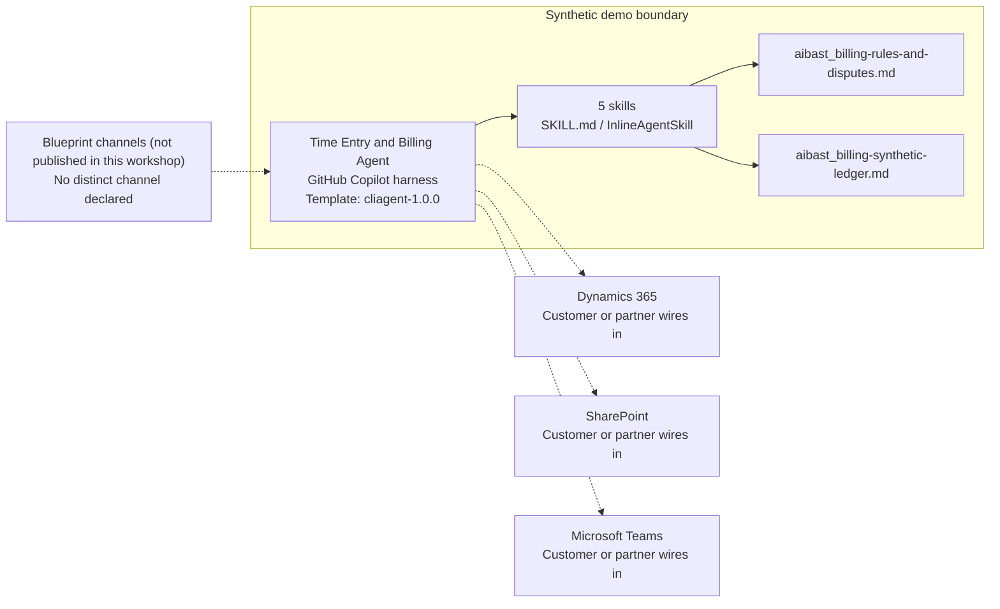

<!-- Generated by tools/build_solution_runbooks.py. Do not edit; change the sources and regenerate. -->

# Time Entry and Billing Agent — Architecture

## Solution Architecture

### Logical architecture and trust boundary

Solid: synthetic design. Dashed: unwired customer systems; channels unpublished.

## Component Responsibilities

| Operation | Capability | Purpose | Owner |
| --- | --- | --- | --- |
| unbilled_report | Billing blocker review | Finds unapproved billable work and the evidence needed to move it. | Template |
| billing_summary | Close rollup | Summarizes project and consultant activity without claiming posted revenue. | Template |
| time_entry_audit | Time-entry control checks | Flags narrative, hours, rate, approval, and budget conditions. | Template |
| invoice_preparation | Approval-gated invoice support | Groups eligible time-and-materials evidence and holds fixed-fee work for milestones. | Template |
| dispute_resolution | Disputed-hours evidence brief | Explains evidence gaps and the internal approval path before client outreach. | Template |

| Runtime reference | Recorded value |
| --- | --- |
| Portable implementation | [time_entry_billing_agent.py](../../agents/@aibast-agents-library/professional_services_stacks/time_entry_billing_stack/time_entry_billing_agent.py) |
| Expected tool | TimeEntryBillingAgent |
| Source SHA-256 (short) | b4284e905391 |

## Data Contract

Approve field meaning, usage and retention before replacing synthetic examples.

| Entity | Fields the template uses | Used by | Customer system of record | Sensitivity |
| --- | --- | --- | --- | --- |
| TIME_ENTRIES | id; consultant; project; date; hours; rate; category; description; approved | unbilled_report; billing_summary; time_entry_audit; invoice_preparation | Dynamics 365 | Consultant time and billing data; restrict to finance and project roles. |
| BILLING_RATES | standard; overtime; max_daily_hours | time_entry_audit | Dynamics 365 | Commercial rate data per consultant; restrict access. |
| PROJECT_BUDGETS | total_budget; billed_to_date; remaining; contract_type; client | billing_summary; time_entry_audit; invoice_preparation | Dynamics 365 | Client contract and budget data; confidential. |
| INVOICE_HISTORY | invoice_id; client; amount; date; status; days_outstanding | unbilled_report; invoice_preparation | Dynamics 365 | Client financial data; the agent reads status and never changes it. |
| DISPUTES | dispute_id; entry_id; client; reason; evidence; recommended_action; status | dispute_resolution | Customer or partner maps | Client dispute evidence; internal until authorized people respond. |

## Integration Points

**State: Not connected in the template.**

| System | Purpose | Skills that need it | Access | Template provides | Customer or partner wires in |
| --- | --- | --- | --- | --- | --- |
| Dynamics 365 | Finance and project records: time, rates, budgets and invoices. | month-end-billing-blockers; billing-close-summary; time-entry-audit; approval-gated-invoice-support | read | Ledger, rate, budget and invoice contracts backed by fictional records; no live connection or write. | [Wiring procedure](3.Runbook.md#step-3-1-integrate-dynamics-365) |
| SharePoint | Approval evidence such as milestone schedules and authorizations. | approval-gated-invoice-support; disputed-hours-evidence-brief | read | Billing rules and dispute evidence as synthetic knowledge; no upload. | [Wiring procedure](3.Runbook.md#step-3-2-integrate-sharepoint) |
| Microsoft Teams | Governed exception review. | month-end-billing-blockers; time-entry-audit; disputed-hours-evidence-brief | write | Evidence-first findings and next authorized reviewer; no message or approval tool. | [Wiring procedure](3.Runbook.md#step-3-3-integrate-microsoft-teams) |

## Identity and Permissions

| Template default | Customer or partner decision |
| --- | --- |
| Authentication: Microsoft Entra ID authentication; the customer selects the supported mode for the intended finance channel. | Confirm tenant, permitted identities and authentication enforcement. |
| Audience: Billing Manager; Finance Vice President; Billing Compliance Lead; Client Finance Partner | Define authorized users, groups and least-privilege connection identities. |

- Require sign-in before exposing time, rate, budget or invoice data.
- Request only the read scopes the approved finance sources need.
- Restrict the audience and test authorized and denied identities.

## Copilot Studio Components

Copilot Studio uses the GitHub Copilot harness; skills hold reviewed behavior.

Agent metadata from [settings.mcs.yml](../../solutions/time-entry-billing/copilot-studio/settings.mcs.yml):

| Setting | Recorded value |
| --- | --- |
| Template | cliagent-1.0.0 |
| Recognizer | CLICopilotRecognizer |
| Authoring model | CliCopilot |
| Model | Sonnet46 |

### Skill inventory

One skill per row: manual upload and source-controlled form.

| Skill | Manual upload | Source component |
| --- | --- | --- |
| approval-gated-invoice-support | [SKILL.md](../../solutions/time-entry-billing/manual/skills/invoice-preparation/SKILL.md) | [InlineAgentSkill](../../solutions/time-entry-billing/copilot-studio/behaviors/aibast_approval-gated-invoice-support.mcs.yml) |
| billing-close-summary | [SKILL.md](../../solutions/time-entry-billing/manual/skills/billing-summary/SKILL.md) | [InlineAgentSkill](../../solutions/time-entry-billing/copilot-studio/behaviors/aibast_billing-close-summary.mcs.yml) |
| disputed-hours-evidence-brief | [SKILL.md](../../solutions/time-entry-billing/manual/skills/dispute-resolution/SKILL.md) | [InlineAgentSkill](../../solutions/time-entry-billing/copilot-studio/behaviors/aibast_disputed-hours-evidence-brief.mcs.yml) |
| month-end-billing-blockers | [SKILL.md](../../solutions/time-entry-billing/manual/skills/unbilled-report/SKILL.md) | [InlineAgentSkill](../../solutions/time-entry-billing/copilot-studio/behaviors/aibast_month-end-billing-blockers.mcs.yml) |
| time-entry-audit | [SKILL.md](../../solutions/time-entry-billing/manual/skills/time-entry-audit/SKILL.md) | [InlineAgentSkill](../../solutions/time-entry-billing/copilot-studio/behaviors/aibast_time-entry-audit.mcs.yml) |

### Knowledge inventory

| Knowledge file | Upload | Source / metadata |
| --- | --- | --- |
| aibast_billing-rules-and-disputes.md | [Content](../../solutions/time-entry-billing/manual/knowledge/aibast_billing-rules-and-disputes.md) | [Source copy](../../solutions/time-entry-billing/copilot-studio/capabilities/knowledge/files/aibast_billing-rules-and-disputes.md) · [Metadata](../../solutions/time-entry-billing/copilot-studio/capabilities/knowledge/files/aibast_billing-rules-and-disputes.md.mcs.yml) |
| aibast_billing-synthetic-ledger.md | [Content](../../solutions/time-entry-billing/manual/knowledge/aibast_billing-synthetic-ledger.md) | [Source copy](../../solutions/time-entry-billing/copilot-studio/capabilities/knowledge/files/aibast_billing-synthetic-ledger.md) · [Metadata](../../solutions/time-entry-billing/copilot-studio/capabilities/knowledge/files/aibast_billing-synthetic-ledger.md.mcs.yml) |

## State and Recovery

| Recovery ID | Condition | Required behavior | Owner |
| --- | --- | --- | --- |
| evidence-no-mockups | A required evidence file is missing | Stop. Capture or restore the real file; never substitute a mockup. | Template |
| failed-case-no-cherry-picking | A recorded identifier is absent | Mark the case failed and investigate; do not retry until it happens to pass. | Template |
| draft-publication-stop | Publish is offered | Stop at Draft unless a separate approver explicitly authorizes publication. | Template |
| billing-grounding-unavailable | The billing knowledge or skill cannot load | Retry once in the same turn, then say so and stop without an uncited answer. | Template |
| finance-system-unavailable | A wired finance, evidence or collaboration system returns no verified result | Report unavailable evidence; never claim a posting, approval, message or invoice succeeded. | Customer or partner |
| billing-write-requested | A request would change time, approve, post, invoice, waive or contact a client | Return the evidence and next authorized approver, and end with the no-change statement. | Template |

Promotion requires separate approval. [Package recovery guide](../../solutions/time-entry-billing/FIELD-GUIDE.md#failure-recovery).

## Design Decisions

| Decision | Reason |
| --- | --- |
| Freeze the ledger as a synthetic close snapshot. | Fictional records make every locked response repeatable; no finance system is queried. |
| Hold fixed-fee time outside invoice value. | Only a milestone schedule can turn fixed-fee delivery evidence into an invoice amount. |
| Separate draft invoice support from posting and sending. | Revenue, posting and invoice actions stay with authorized finance approvers. |
| End every answer with the fixed no-change statement. | It restates that no time, approval, revenue, invoice or client record changed. |
| Use exact assertions, not a quality-score substitute. | General quality in Evaluate (preview) does not compare responses with expected answers. |

## Non-Functional Considerations

| Area | Customer or partner confirms |
| --- | --- |
| Licensing and Copilot Credits | Confirm tenant licensing and budget credits for building, Preview, evaluation and production use. |
| Capacity | Allocate approved capacity to the billing environment and monitor consumption before widening the audience. |
| Data residency | Approve the environment geography and any movement of time, rate or client financial data across regions or systems. |
| Retention | Decide whether transcripts are saved, who can view or download them, and the Dataverse retention policy. |
| Cost drivers | Measure model, knowledge, tool and harness usage by workload; the synthetic demo is not a production-cost estimate. |

## Next

→ [Delivery runbook](3.Runbook.md) | [Solution index](../README.md)

[Sources for this page](0.Resources/README.md#sources-2architecturemd).
