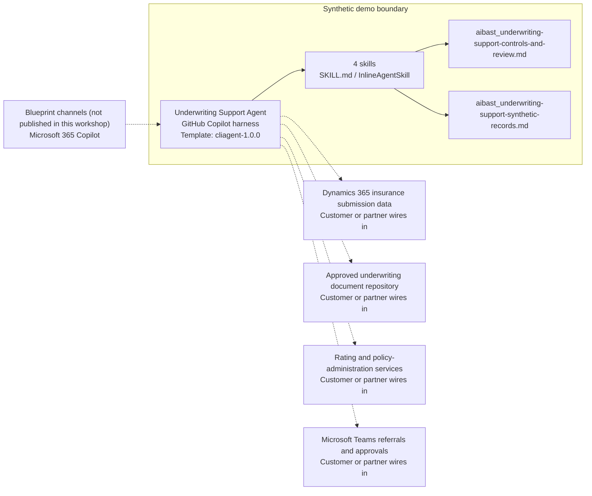

<!-- Generated by tools/build_solution_runbooks.py. Do not edit; change the sources and regenerate. -->

# Underwriting Support Agent — Architecture

## Solution Architecture

### Logical architecture and trust boundary

Solid: synthetic design. Dashed: unwired customer systems; channels unpublished.

## Component Responsibilities

| Operation | Capability | Purpose | Owner |
| --- | --- | --- | --- |
| risk_evaluation | Submission risk evaluation | Summarizes submission risk scores, tiers, and current review status. | Template |
| pricing_recommendation | Illustrative pricing-factor review | Displays synthetic rating inputs and loss history without quoting or binding coverage. | Template |
| guideline_check | Guideline and document alignment | Checks coverage limits, required documents, inspections, and stated risk rules. | Template |
| exception_review | Exception review queue | Prepares exceptions and human review paths without approving or declining risk. | Template |

| Runtime reference | Recorded value |
| --- | --- |
| Portable implementation | [underwriting_support_agent.py](../../agents/@aibast-agents-library/financial_services_stacks/underwriting_support_stack/underwriting_support_agent.py) |
| Expected tool | UnderwritingSupportAgent |
| Source SHA-256 (short) | 2e6378aa4023 |

## Data Contract

Approve field meaning, usage and retention before replacing synthetic examples.

| Entity | Fields the template uses | Used by | Customer system of record | Sensitivity |
| --- | --- | --- | --- | --- |
| APPLICATIONS — submission | applicant; line_of_business; coverage_requested; premium_indicated; risk_score; status; underwriter | risk_evaluation; pricing_recommendation; guideline_check; exception_review | Dynamics 365 insurance submission data | Applicant and submission data; restrict to underwriting roles. |
| APPLICATIONS — line-of-business details | property_type; construction; year_built; square_footage; protection_class; vehicle; driver_age; driving_record; credit_score; specialty; practitioners; years_in_practice; business_type; locations; annual_revenue; employees | pricing_recommendation; guideline_check; exception_review | Dynamics 365 insurance submission data | Includes personal driving and credit data; minimize and restrict. |
| APPLICATIONS loss_history and claims_history | year; type; allegation; amount; status | pricing_recommendation; guideline_check | Customer or partner maps | Loss and claims data; confidential underwriting evidence. |
| UNDERWRITING_GUIDELINES | max_coverage; min_protection_class; max_building_age; max_loss_ratio; required_inspections; prohibited_risks; min_driver_age; max_violations_3yr; max_accidents_3yr; min_credit_score; required_documents; high_risk_specialties; max_claims_5yr; min_years_practice; min_years_business | guideline_check; exception_review | Customer or partner maps | Carrier guideline policy; fictional limits must be replaced. |
| PRICING_MODELS | base_rate_per_100; construction_factor; protection_class_factor; base_premium; age_factor; credit_factor; base_rate_per_practitioner; specialty_factor; base_rate_per_1000_revenue; industry_factor | pricing_recommendation | Rating and policy-administration services | Proprietary rating factors; illustrative only, never a quote. |

## Integration Points

**State: Not connected in the template.**

| System | Purpose | Skills that need it | Access | Template provides | Customer or partner wires in |
| --- | --- | --- | --- | --- | --- |
| Dynamics 365 insurance submission data | Submissions, applicants, coverage requests, loss history and status. | risk-evaluation; pricing-recommendation; guideline-check; exception-review | read | Submission contracts backed by fixed fictional applications; no live connection. | [Wiring procedure](3.Runbook.md#step-3-1-integrate-dynamics-365-insurance-submission-data) |
| Approved underwriting document repository | Submission documents, inspections and supporting evidence. | guideline-check; exception-review | read | Required-document and inspection rules; no document retrieval. | [Wiring procedure](3.Runbook.md#step-3-2-integrate-approved-underwriting-document-repository) |
| Rating and policy-administration services | Controlled rating factors and policy context. | pricing-recommendation | read | Illustrative factors and indicated premium; no quote, binder or pricing action. | [Wiring procedure](3.Runbook.md#step-3-3-integrate-rating-and-policy-administration-services) |
| Microsoft Teams referrals and approvals | Referral and authority workflows. | exception-review; guideline-check | write | Exception files and human review paths; no referral, message or approval tool. | [Wiring procedure](3.Runbook.md#step-3-4-integrate-microsoft-teams-referrals-and-approvals) |

## Identity and Permissions

| Template default | Customer or partner decision |
| --- | --- |
| Authentication: Microsoft Entra ID authentication; the customer selects the supported mode for the intended underwriting channel. | Confirm tenant, permitted identities and authentication enforcement. |
| Audience: Underwriter; Pricing Analyst; Risk Analyst; Senior Underwriter | Define authorized users, groups and least-privilege connection identities. |

- Require sign-in before exposing applicant, loss or rating data.
- Request only the read scopes the approved underwriting sources need.
- Restrict the audience and test authorized and denied identities.

## Copilot Studio Components

Copilot Studio uses the GitHub Copilot harness; skills hold reviewed behavior.

Agent metadata from [settings.mcs.yml](../../solutions/underwriting-support/copilot-studio/settings.mcs.yml):

| Setting | Recorded value |
| --- | --- |
| Template | cliagent-1.0.0 |
| Recognizer | CLICopilotRecognizer |
| Authoring model | CliCopilot |
| Model | Sonnet46 |

### Skill inventory

One skill per row: manual upload and source-controlled form.

| Skill | Manual upload | Source component |
| --- | --- | --- |
| exception-review | [SKILL.md](../../solutions/underwriting-support/manual/skills/aibast_exception-review_04/SKILL.md) | [InlineAgentSkill](../../solutions/underwriting-support/copilot-studio/behaviors/aibast_exception-review.mcs.yml) |
| guideline-check | [SKILL.md](../../solutions/underwriting-support/manual/skills/aibast_guideline-check_03/SKILL.md) | [InlineAgentSkill](../../solutions/underwriting-support/copilot-studio/behaviors/aibast_guideline-check.mcs.yml) |
| pricing-recommendation | [SKILL.md](../../solutions/underwriting-support/manual/skills/aibast_pricing-recommendation_02/SKILL.md) | [InlineAgentSkill](../../solutions/underwriting-support/copilot-studio/behaviors/aibast_pricing-recommendation.mcs.yml) |
| risk-evaluation | [SKILL.md](../../solutions/underwriting-support/manual/skills/aibast_risk-evaluation_01/SKILL.md) | [InlineAgentSkill](../../solutions/underwriting-support/copilot-studio/behaviors/aibast_risk-evaluation.mcs.yml) |

### Knowledge inventory

| Knowledge file | Upload | Source / metadata |
| --- | --- | --- |
| aibast_underwriting-support-controls-and-review.md | [Content](../../solutions/underwriting-support/manual/knowledge/aibast_underwriting-support-controls-and-review.md) | [Source copy](../../solutions/underwriting-support/copilot-studio/capabilities/knowledge/files/aibast_underwriting-support-controls-and-review.md) · [Metadata](../../solutions/underwriting-support/copilot-studio/capabilities/knowledge/files/aibast_underwriting-support-controls-and-review.md.mcs.yml) |
| aibast_underwriting-support-synthetic-records.md | [Content](../../solutions/underwriting-support/manual/knowledge/aibast_underwriting-support-synthetic-records.md) | [Source copy](../../solutions/underwriting-support/copilot-studio/capabilities/knowledge/files/aibast_underwriting-support-synthetic-records.md) · [Metadata](../../solutions/underwriting-support/copilot-studio/capabilities/knowledge/files/aibast_underwriting-support-synthetic-records.md.mcs.yml) |

## State and Recovery

| Recovery ID | Condition | Required behavior | Owner |
| --- | --- | --- | --- |
| evidence-no-mockups | A required evidence file is missing | Stop. Capture or restore the real file; never substitute a mockup. | Template |
| failed-case-no-cherry-picking | A recorded identifier is absent | Mark the case failed and investigate; do not retry until it happens to pass. | Template |
| draft-publication-stop | Publish is offered | Stop at Draft unless a separate approver explicitly authorizes publication. | Template |
| unknown-application | An application identifier is not in the fixed records | Reject it; never substitute or invent a record. | Template |
| unpackaged-rule | A requested guideline, rate or authority limit is not packaged | State that it requires authoritative carrier review. | Template |
| underwriting-system-unavailable | A wired submission, document, rating or referral system returns no verified result | Report unavailable evidence; never claim a lookup, referral or coverage action succeeded. | Customer or partner |

Promotion requires separate approval. [Package recovery guide](../../solutions/underwriting-support/FIELD-GUIDE.md#failure-recovery).

## Design Decisions

| Decision | Reason |
| --- | --- |
| Separate evidence, analysis, preparation, human decision and external action. | Authorized underwriters and reviewers own every coverage decision. |
| Label pricing output illustrative. | Packaged rating factors support review, not quotes or pricing actions. |
| Refer unpackaged rules to the carrier. | Browsed or invented guidelines, rates or authority limits would be ungoverned evidence. |
| End substantive answers with the fixed decision-boundary statement. | It states that no quote, binder, approval, decline, policy change or coverage decision occurred. |
| Use exact assertions, not a quality-score substitute. | General quality in Evaluate (preview) does not compare responses with expected answers. |

## Non-Functional Considerations

| Area | Customer or partner confirms |
| --- | --- |
| Licensing and Copilot Credits | Confirm tenant licensing and budget credits for building, Preview, evaluation and production use. |
| Capacity | Allocate approved capacity to the underwriting environment and monitor consumption before widening the audience. |
| Data residency | Approve the environment geography and any movement of applicant, loss or rating data across regions or systems. |
| Retention | Decide whether transcripts are saved, who can view or download them, and the Dataverse retention policy. |
| Cost drivers | Measure model, knowledge, tool and harness usage by workload; the synthetic demo is not a production-cost estimate. |

## Next

→ [Delivery runbook](3.Runbook.md) | [Solution index](../README.md)

[Sources for this page](0.Resources/README.md#sources-2architecturemd).
