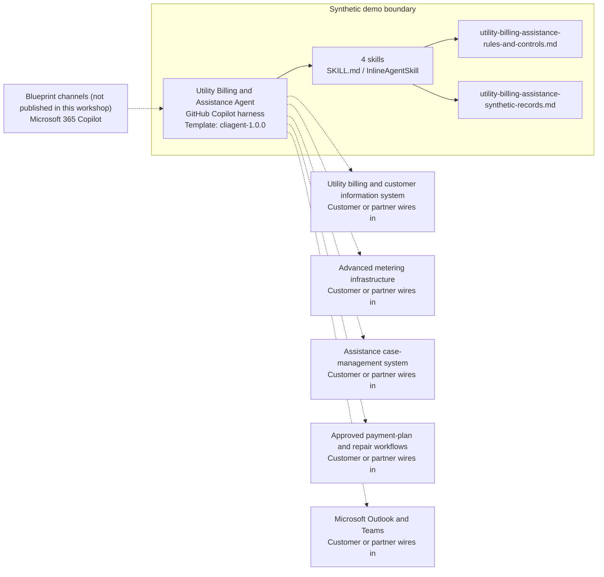

<!-- Generated by tools/build_solution_runbooks.py. Do not edit; change the sources and regenerate. -->

# Utility Billing and Assistance Agent — Architecture

## Solution Architecture

### Logical architecture and trust boundary

Solid: synthetic design. Dashed: unwired customer systems; channels unpublished.

## Component Responsibilities

| Operation | Capability | Purpose | Owner |
| --- | --- | --- | --- |
| billing_inquiry | Read-only account explanation | Summarizes synthetic balances, services, payment history, and account state without changing a record. | Template |
| usage_analysis | Leak and usage screening | Reviews synthetic meter history and drafts a policy estimate without diagnosing a leak or adjusting a bill. | Template |
| payment_plan | Draft payment-plan options | Calculates non-binding installment options without creating an agreement. | Template |
| assistance_programs | Preliminary assistance screening | Compares supplied household facts with synthetic criteria without determining eligibility or enrolling an applicant. | Template |

| Runtime reference | Recorded value |
| --- | --- |
| Portable implementation | [utility_billing_assistance_agent.py](../../agents/@aibast-agents-library/slg_government_stacks/utility_billing_assistance_stack/utility_billing_assistance_agent.py) |
| Expected tool | UtilityBillingAssistanceAgent |
| Source SHA-256 (short) | ff1bddd2b0d8 |

## Data Contract

Approve field meaning, usage and retention before replacing synthetic examples.

| Entity | Fields the template uses | Used by | Customer system of record | Sensitivity |
| --- | --- | --- | --- | --- |
| UTILITY_ACCOUNTS | customer; address; account_type; services; status; balance_current; balance_past_due; autopay; last_payment | billing_inquiry; usage_analysis; payment_plan | Utility billing and customer information system | Resident personal and account data; restrict to service staff. |
| USAGE_HISTORY | period; water_gallons; sewer_gallons; amount | usage_analysis | Advanced metering infrastructure | Household consumption data; an anomaly is not a leak diagnosis. |
| RATE_STRUCTURES | water_residential; water_commercial; sewer; stormwater; trash; base_charge; tiers; rate_per_1000 | usage_analysis | Utility billing and customer information system | Rate policy data; the customer replaces the fictional tiers. |
| LEAK_ADJUSTMENT_POLICY | lookback_months; credit_rate_pct; requirements | usage_analysis | Customer or partner maps | Adjustment policy; estimates need billing-specialist approval. |
| ASSISTANCE_PROGRAMS | name; income_limit_pct_fpl; max_benefit; eligibility; documents_required; status; discount_pct; max_installments | assistance_programs; payment_plan | Customer or partner maps | Program criteria; screening uses household income and age, so minimize and restrict. |

## Integration Points

**State: Not connected in the template.**

| System | Purpose | Skills that need it | Access | Template provides | Customer or partner wires in |
| --- | --- | --- | --- | --- | --- |
| Utility billing and customer information system | Accounts, balances, services, payments and rates. | utility-billing-assistance-billing-inquiry; utility-billing-assistance-usage-analysis; utility-billing-assistance-payment-plan | read | Account and rate contracts backed by fictional records; no live connection or write. | [Wiring procedure](3.Runbook.md#step-3-1-integrate-utility-billing-and-customer-information-system) |
| Advanced metering infrastructure | Meter usage history for anomaly screening. | utility-billing-assistance-usage-analysis | read | Fixed usage periods and baseline rules; no diagnosis or field order. | [Wiring procedure](3.Runbook.md#step-3-2-integrate-advanced-metering-infrastructure) |
| Assistance case-management system | Program cases and required documents. | utility-billing-assistance-assistance-programs | read | Synthetic program criteria for preliminary screening; no application or enrollment. | [Wiring procedure](3.Runbook.md#step-3-3-integrate-assistance-case-management-system) |
| Approved payment-plan and repair workflows | Authorized payment agreements and repair scheduling. | utility-billing-assistance-payment-plan; utility-billing-assistance-usage-analysis | write | Modeled options and draft evidence; no agreement or repair tool. | [Wiring procedure](3.Runbook.md#step-3-4-integrate-approved-payment-plan-and-repair-workflows) |
| Microsoft Outlook and Teams | Staff coordination and any resident notice. | utility-billing-assistance-billing-inquiry; utility-billing-assistance-payment-plan; utility-billing-assistance-assistance-programs | write | Internal decision-support responses; no notice, email or message tool. | [Wiring procedure](3.Runbook.md#step-3-5-integrate-microsoft-outlook-and-teams) |

## Identity and Permissions

| Template default | Customer or partner decision |
| --- | --- |
| Authentication: Microsoft Entra ID authentication; the customer selects the supported mode for the intended staff channel. | Confirm tenant, permitted identities and authentication enforcement. |
| Audience: Customer Service Representative; Billing Specialist; Revenue Services Supervisor; Assistance Coordinator | Define authorized users, groups and least-privilege connection identities. |

- Require sign-in before exposing resident, meter or assistance data.
- Request only the read scopes the approved utility sources need.
- Restrict the staff audience and test authorized and denied identities.

## Copilot Studio Components

Copilot Studio uses the GitHub Copilot harness; skills hold reviewed behavior.

Agent metadata from [settings.mcs.yml](../../solutions/utility-billing-assistance/copilot-studio/settings.mcs.yml):

| Setting | Recorded value |
| --- | --- |
| Template | cliagent-1.0.0 |
| Recognizer | CLICopilotRecognizer |
| Authoring model | CliCopilot |
| Model | Sonnet46 |

### Skill inventory

One skill per row: manual upload and source-controlled form.

| Skill | Manual upload | Source component |
| --- | --- | --- |
| utility-billing-assistance-assistance-programs | [SKILL.md](../../solutions/utility-billing-assistance/manual/skills/aibast_assistance-programs/SKILL.md) | [InlineAgentSkill](../../solutions/utility-billing-assistance/copilot-studio/behaviors/aibast_utility-billing-assistance-assistance-programs.mcs.yml) |
| utility-billing-assistance-billing-inquiry | [SKILL.md](../../solutions/utility-billing-assistance/manual/skills/aibast_billing-inquiry/SKILL.md) | [InlineAgentSkill](../../solutions/utility-billing-assistance/copilot-studio/behaviors/aibast_utility-billing-assistance-billing-inquiry.mcs.yml) |
| utility-billing-assistance-payment-plan | [SKILL.md](../../solutions/utility-billing-assistance/manual/skills/aibast_payment-plan/SKILL.md) | [InlineAgentSkill](../../solutions/utility-billing-assistance/copilot-studio/behaviors/aibast_utility-billing-assistance-payment-plan.mcs.yml) |
| utility-billing-assistance-usage-analysis | [SKILL.md](../../solutions/utility-billing-assistance/manual/skills/aibast_usage-analysis/SKILL.md) | [InlineAgentSkill](../../solutions/utility-billing-assistance/copilot-studio/behaviors/aibast_utility-billing-assistance-usage-analysis.mcs.yml) |

### Knowledge inventory

| Knowledge file | Upload | Source / metadata |
| --- | --- | --- |
| utility-billing-assistance-rules-and-controls.md | [Content](../../solutions/utility-billing-assistance/manual/knowledge/utility-billing-assistance-rules-and-controls.md) | [Source copy](../../solutions/utility-billing-assistance/copilot-studio/capabilities/knowledge/files/utility-billing-assistance-rules-and-controls.md) · [Metadata](../../solutions/utility-billing-assistance/copilot-studio/capabilities/knowledge/files/utility-billing-assistance-rules-and-controls.md.mcs.yml) |
| utility-billing-assistance-synthetic-records.md | [Content](../../solutions/utility-billing-assistance/manual/knowledge/utility-billing-assistance-synthetic-records.md) | [Source copy](../../solutions/utility-billing-assistance/copilot-studio/capabilities/knowledge/files/utility-billing-assistance-synthetic-records.md) · [Metadata](../../solutions/utility-billing-assistance/copilot-studio/capabilities/knowledge/files/utility-billing-assistance-synthetic-records.md.mcs.yml) |

## State and Recovery

| Recovery ID | Condition | Required behavior | Owner |
| --- | --- | --- | --- |
| evidence-no-mockups | A required evidence file is missing | Stop. Capture or restore the real file; never substitute a mockup. | Template |
| failed-case-no-cherry-picking | A recorded identifier is absent | Mark the case failed and investigate; do not retry until it happens to pass. | Template |
| draft-publication-stop | Publish is offered | Stop at Draft unless a separate approver explicitly authorizes publication. | Template |
| account-identifier-absent | A requested account identifier is not in the records | Say so and return no substituted account. | Template |
| utility-system-unavailable | A wired billing, metering or case system returns no verified result | Report unavailable evidence; never claim an adjustment, plan, enrollment or notice succeeded. | Customer or partner |
| utility-write-requested | A request would adjust a bill, enroll, start a plan, schedule a repair or change an account | Return analysis or a draft and name the authorized staff; perform no write. | Template |

Promotion requires separate approval. [Package recovery guide](../../solutions/utility-billing-assistance/FIELD-GUIDE.md#failure-recovery).

## Design Decisions

| Decision | Reason |
| --- | --- |
| Separate analysis and drafting from any future write action. | Authorized utility staff and the customer approve every action. |
| Create read tools first; isolate any future write. | Writes need authorization, current-state validation, explicit confirmation and immutable audit logging. |
| Treat anomalies as screening, not diagnosis. | Leak confirmation and field work stay with staff; estimates stay non-binding. |
| Screen assistance without deciding eligibility. | Screening reports potential matches and required documents; eligibility and enrollment stay with authorized staff. |
| Use exact assertions, not a quality-score substitute. | General quality in Evaluate (preview) does not compare responses with expected answers. |

## Non-Functional Considerations

| Area | Customer or partner confirms |
| --- | --- |
| Licensing and Copilot Credits | Confirm tenant licensing and budget credits for building, Preview, evaluation and production use. |
| Capacity | Allocate approved capacity to the utility environment and monitor consumption before widening the audience. |
| Data residency | Approve the environment geography and any movement of resident, meter or assistance data across regions or systems. |
| Retention | Decide whether transcripts are saved, who can view or download them, and the Dataverse retention policy. |
| Cost drivers | Measure model, knowledge, tool and harness usage by workload; the synthetic demo is not a production-cost estimate. |

## Next

→ [Delivery runbook](3.Runbook.md) | [Solution index](../README.md)

[Sources for this page](0.Resources/README.md#sources-2architecturemd).
