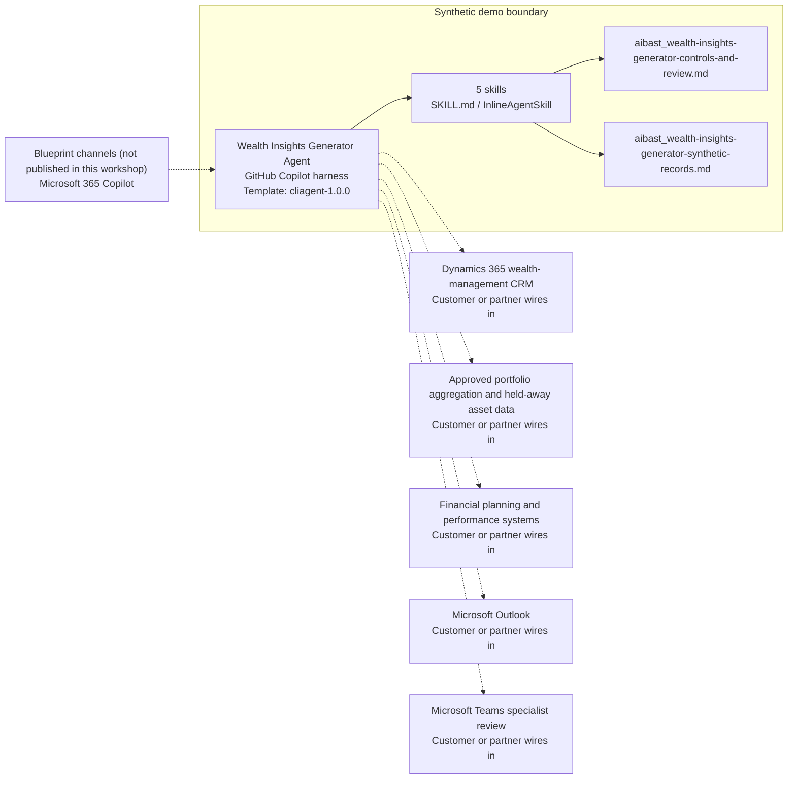

<!-- Generated by tools/build_solution_runbooks.py. Do not edit; change the sources and regenerate. -->

# Wealth Insights Generator Agent — Architecture

## Solution Architecture

### Logical architecture and trust boundary

Solid: synthetic design. Dashed: unwired customer systems; channels unpublished.

## Component Responsibilities

| Operation | Capability | Purpose | Owner |
| --- | --- | --- | --- |
| market_brief | Fixed market snapshot | Presents a clearly labeled synthetic market snapshot rather than current market data. | Template |
| client_insights | Unified wealth insights | Combines managed and held-away synthetic assets, performance, reviews, and life events. | Template |
| opportunity_alerts | Planning-gap signals | Prioritizes reviewable relationship and planning signals without giving advice or contacting a client. | Template |
| performance_attribution | Performance context | Compares synthetic portfolio performance with fixed strategy benchmarks. | Template |
| meeting_brief | Advisor meeting preparation | Drafts review material and discussion prompts for licensed-advisor validation. | Template |

| Runtime reference | Recorded value |
| --- | --- |
| Portable implementation | [wealth_insights_generator_agent.py](../../agents/@aibast-agents-library/financial_services_stacks/wealth_insights_generator_stack/wealth_insights_generator_agent.py) |
| Expected tool | WealthInsightsGeneratorAgent |
| Source SHA-256 (short) | aec5aca34097 |

## Data Contract

Approve field meaning, usage and retention before replacing synthetic examples.

| Entity | Fields the template uses | Used by | Customer system of record | Sensitivity |
| --- | --- | --- | --- | --- |
| CLIENT_PORTFOLIOS — relationship | name; risk_profile; last_contact; next_review; life_events | client_insights; opportunity_alerts; meeting_brief | Dynamics 365 wealth-management CRM | Client personal and life-event data; restrict to licensed advisors. |
| CLIENT_PORTFOLIOS — assets | aum; held_away_assets | market_brief; client_insights; performance_attribution; meeting_brief | Approved portfolio aggregation and held-away asset data | Client holdings, including held-away assets; restrict by relationship. |
| CLIENT_PORTFOLIOS — performance | strategy; ytd_return; benchmark_return; alpha | client_insights; performance_attribution | Financial planning and performance systems | Performance data; not a forecast or promise. |
| PERFORMANCE_BENCHMARKS | benchmark; 1yr; 3yr; 5yr | performance_attribution | Financial planning and performance systems | Benchmark reference data; fixed synthetic values. |
| OPPORTUNITY_SIGNALS | client; type; description; priority; action | opportunity_alerts; meeting_brief | Financial planning and performance systems | Planning signals; suggested actions are review prompts, not tasks performed. |
| MARKET_DATA | current; ytd_return; pe_ratio; dividend_yield | market_brief | Customer or partner maps | Market reference data; fixed and never current. |

## Integration Points

**State: Not connected in the template.**

| System | Purpose | Skills that need it | Access | Template provides | Customer or partner wires in |
| --- | --- | --- | --- | --- | --- |
| Dynamics 365 wealth-management CRM | Relationship context, review dates and life events. | client-insights; opportunity-alerts; meeting-brief | read | Relationship contracts backed by fictional households; no live connection or CRM change. | [Wiring procedure](3.Runbook.md#step-3-1-integrate-dynamics-365-wealth-management-crm) |
| Approved portfolio aggregation and held-away asset data | Managed and held-away asset evidence. | market-brief; client-insights; performance-attribution; meeting-brief | read | Fixed asset values; no live account aggregation. | [Wiring procedure](3.Runbook.md#step-3-2-integrate-approved-portfolio-aggregation-and-held-away-asset-data) |
| Financial planning and performance systems | Planning signals, benchmarks and performance evidence. | client-insights; opportunity-alerts; performance-attribution | read | Bundled fictional returns, benchmarks and planning signals. | [Wiring procedure](3.Runbook.md#step-3-3-integrate-financial-planning-and-performance-systems) |
| Microsoft Outlook | Controlled preparation of reviewed materials. | meeting-brief | write | Draft preparation material; no send, scheduling or client-contact tool. | [Wiring procedure](3.Runbook.md#step-3-4-integrate-microsoft-outlook) |
| Microsoft Teams specialist review | Specialist and compliance review collaboration. | opportunity-alerts; meeting-brief | write | Review gates named in each answer; no message, approval or action tool. | [Wiring procedure](3.Runbook.md#step-3-5-integrate-microsoft-teams-specialist-review) |

## Identity and Permissions

| Template default | Customer or partner decision |
| --- | --- |
| Authentication: Microsoft Entra ID authentication; the customer selects the supported mode for the intended advisor channel. | Confirm tenant, permitted identities and authentication enforcement. |
| Audience: Wealth Advisor; Relationship Manager; Advisory Director; Portfolio Strategist | Define authorized users, groups and least-privilege connection identities. |

- Require sign-in before exposing client, asset or planning data.
- Request only the read scopes the approved wealth sources need.
- Restrict the audience and test authorized and denied identities.

## Copilot Studio Components

Copilot Studio uses the GitHub Copilot harness; skills hold reviewed behavior.

Agent metadata from [settings.mcs.yml](../../solutions/wealth-insights-generator/copilot-studio/settings.mcs.yml):

| Setting | Recorded value |
| --- | --- |
| Template | cliagent-1.0.0 |
| Recognizer | CLICopilotRecognizer |
| Authoring model | CliCopilot |
| Model | Sonnet46 |

### Skill inventory

One skill per row: manual upload and source-controlled form.

| Skill | Manual upload | Source component |
| --- | --- | --- |
| client-insights | [SKILL.md](../../solutions/wealth-insights-generator/manual/skills/aibast_client-insights_02/SKILL.md) | [InlineAgentSkill](../../solutions/wealth-insights-generator/copilot-studio/behaviors/aibast_client-insights.mcs.yml) |
| market-brief | [SKILL.md](../../solutions/wealth-insights-generator/manual/skills/aibast_market-brief_01/SKILL.md) | [InlineAgentSkill](../../solutions/wealth-insights-generator/copilot-studio/behaviors/aibast_market-brief.mcs.yml) |
| meeting-brief | [SKILL.md](../../solutions/wealth-insights-generator/manual/skills/aibast_meeting-brief_05/SKILL.md) | [InlineAgentSkill](../../solutions/wealth-insights-generator/copilot-studio/behaviors/aibast_meeting-brief.mcs.yml) |
| opportunity-alerts | [SKILL.md](../../solutions/wealth-insights-generator/manual/skills/aibast_opportunity-alerts_03/SKILL.md) | [InlineAgentSkill](../../solutions/wealth-insights-generator/copilot-studio/behaviors/aibast_opportunity-alerts.mcs.yml) |
| performance-attribution | [SKILL.md](../../solutions/wealth-insights-generator/manual/skills/aibast_performance-attribution_04/SKILL.md) | [InlineAgentSkill](../../solutions/wealth-insights-generator/copilot-studio/behaviors/aibast_performance-attribution.mcs.yml) |

### Knowledge inventory

| Knowledge file | Upload | Source / metadata |
| --- | --- | --- |
| aibast_wealth-insights-generator-controls-and-review.md | [Content](../../solutions/wealth-insights-generator/manual/knowledge/aibast_wealth-insights-generator-controls-and-review.md) | [Source copy](../../solutions/wealth-insights-generator/copilot-studio/capabilities/knowledge/files/aibast_wealth-insights-generator-controls-and-review.md) · [Metadata](../../solutions/wealth-insights-generator/copilot-studio/capabilities/knowledge/files/aibast_wealth-insights-generator-controls-and-review.md.mcs.yml) |
| aibast_wealth-insights-generator-synthetic-records.md | [Content](../../solutions/wealth-insights-generator/manual/knowledge/aibast_wealth-insights-generator-synthetic-records.md) | [Source copy](../../solutions/wealth-insights-generator/copilot-studio/capabilities/knowledge/files/aibast_wealth-insights-generator-synthetic-records.md) · [Metadata](../../solutions/wealth-insights-generator/copilot-studio/capabilities/knowledge/files/aibast_wealth-insights-generator-synthetic-records.md.mcs.yml) |

## State and Recovery

| Recovery ID | Condition | Required behavior | Owner |
| --- | --- | --- | --- |
| evidence-no-mockups | A required evidence file is missing | Stop. Capture or restore the real file; never substitute a mockup. | Template |
| failed-case-no-cherry-picking | A recorded identifier is absent | Mark the case failed and investigate; do not retry until it happens to pass. | Template |
| draft-publication-stop | Publish is offered | Stop at Draft unless a separate approver explicitly authorizes publication. | Template |
| unknown-client-id | A client identifier is not in the fixed records | Reject it; never substitute a household or fabricate evidence. | Template |
| wealth-system-unavailable | A wired CRM, aggregation, planning or messaging system returns no verified result | Report unavailable evidence; never claim a lookup, outreach, CRM change or order succeeded. | Customer or partner |
| wealth-action-requested | A request would contact a client, schedule, update CRM, create an opportunity, order or transact | Return preparation material and name the licensed reviewer; perform no action. | Template |

Promotion requires separate approval. [Package recovery guide](../../solutions/wealth-insights-generator/FIELD-GUIDE.md#failure-recovery).

## Design Decisions

| Decision | Reason |
| --- | --- |
| Separate evidence, analysis, preparation, human decision and external action. | Licensed advisors, clients and specialists own advice, suitability and actions. |
| Label the market snapshot fixed and non-current. | A current-market claim would present synthetic values as live data. |
| Reject unknown client IDs. | Substituting a household would fabricate wealth, planning or performance evidence. |
| End substantive answers with the fixed regulated-boundary statement. | It states that no advice, outreach, CRM change, order or transaction occurred. |
| Use exact assertions, not a quality-score substitute. | General quality in Evaluate (preview) does not compare responses with expected answers. |

## Non-Functional Considerations

| Area | Customer or partner confirms |
| --- | --- |
| Licensing and Copilot Credits | Confirm tenant licensing and budget credits for building, Preview, evaluation and production use. |
| Capacity | Allocate approved capacity to the wealth environment and monitor consumption before widening the audience. |
| Data residency | Approve the environment geography and any movement of client, asset or planning data across regions or systems. |
| Retention | Decide whether transcripts are saved, who can view or download them, and the Dataverse retention policy. |
| Cost drivers | Measure model, knowledge, tool and harness usage by workload; the synthetic demo is not a production-cost estimate. |

## Next

→ [Delivery runbook](3.Runbook.md) | [Solution index](../README.md)

[Sources for this page](0.Resources/README.md#sources-2architecturemd).
