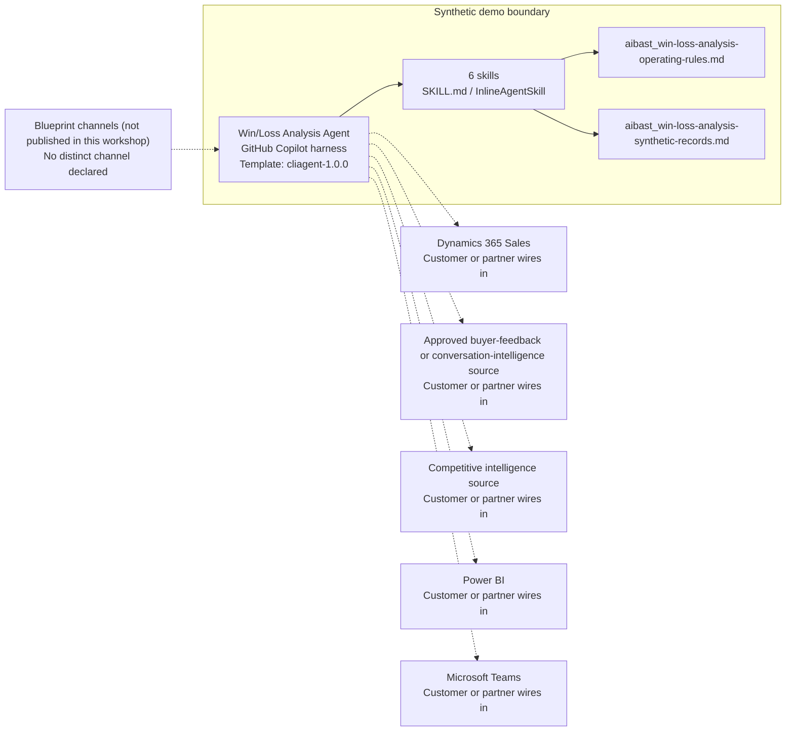

<!-- Generated by tools/build_solution_runbooks.py. Do not edit; change the sources and regenerate. -->

# Win/Loss Analysis Agent — Architecture

## Solution Architecture

### Logical architecture and trust boundary

Solid: synthetic design. Dashed: unwired customer systems; channels unpublished.

## Component Responsibilities

| Operation | Capability | Purpose | Owner |
| --- | --- | --- | --- |
| win_loss_overview | Win Loss Overview | Compares structured outcome and competitor patterns. | Template |
| root_cause_analysis | Root Cause Analysis | Ranks evidence-backed loss drivers and buyer-feedback themes. | Template |
| counter_strategies | Counter Strategies | Drafts near-term and longer-term enablement options. | Template |
| revenue_impact | Revenue Impact | Models clearly labeled value scenarios rather than revenue commitments. | Template |
| board_presentation | Board Presentation | Drafts a leadership narrative with explicit scenario boundaries. | Template |
| action_summary | Action Summary | Summarizes findings and candidate next steps without activation. | Template |

| Runtime reference | Recorded value |
| --- | --- |
| Portable implementation | [win_loss_analysis_agent.py](../../agents/@aibast-agents-library/b2b_sales_stacks/win_loss_analysis_stack/win_loss_analysis_agent.py) |
| Expected tool | WinLossAnalysisAgent |
| Source SHA-256 (short) | f81d4fc89602 |

## Data Contract

Approve field meaning, usage and retention before replacing synthetic examples.

| Entity | Fields the template uses | Used by | Customer system of record | Sensitivity |
| --- | --- | --- | --- | --- |
| _Q3_OPPORTUNITIES and _Q2_OPPORTUNITIES | account; competitor_lost_to; deal_size_bucket; loss_reason; name; outcome; segment; value | win_loss_overview; root_cause_analysis; counter_strategies; revenue_impact; board_presentation; action_summary | Dynamics 365 Sales | Customer account and deal data; restrict to sales roles. |
| _INTERVENTIONS | actions; cost; label; recovery_rate; timeline | counter_strategies; revenue_impact; board_presentation; action_summary | Customer or partner maps | Planning assumptions; costs and recovery rates are synthetic scenarios, not forecasts. |
| _root_cause_analysis buyer_quotes | security_certs; enterprise_references; pricing; feature_gaps; relationship | root_cause_analysis | Approved buyer-feedback or conversation-intelligence source | Buyer statements keyed by loss reason; confirm permitted use with the data owner. |

## Integration Points

**State: Not connected in the template.**

| System | Purpose | Skills that need it | Access | Template provides | Customer or partner wires in |
| --- | --- | --- | --- | --- | --- |
| Dynamics 365 Sales | Closed-opportunity evidence: outcomes, segments, values, competitors and loss reasons. | win-loss-analysis-win-loss-overview; win-loss-analysis-root-cause-analysis; win-loss-analysis-counter-strategies; win-loss-analysis-revenue-impact; win-loss-analysis-board-presentation; win-loss-analysis-action-summary | read | Opportunity contracts backed by fixed synthetic deals; no CRM query or write. | [Wiring procedure](3.Runbook.md#step-3-1-integrate-dynamics-365-sales) |
| Approved buyer-feedback or conversation-intelligence source | Buyer feedback behind loss themes. | win-loss-analysis-root-cause-analysis; win-loss-analysis-counter-strategies | read | Bundled synthetic feedback statements; no call retrieval or comment search. | [Wiring procedure](3.Runbook.md#step-3-2-integrate-approved-buyer-feedback-or-conversation-intelligence-source) |
| Competitive intelligence source | Approved competitor context for loss analysis and counter-strategies. | win-loss-analysis-win-loss-overview; win-loss-analysis-root-cause-analysis; win-loss-analysis-counter-strategies | read | Competitor names from the synthetic deals; no competitor research. | [Wiring procedure](3.Runbook.md#step-3-3-integrate-competitive-intelligence-source) |
| Power BI | Trend visualization. | win-loss-analysis-win-loss-overview; win-loss-analysis-board-presentation | read | Overview and scenario tables from synthetic data; no live report. | [Wiring procedure](3.Runbook.md#step-3-4-integrate-power-bi) |
| Microsoft Teams | Enablement review. | win-loss-analysis-counter-strategies; win-loss-analysis-action-summary | write | Draft options and named approval gates; no message, task or alert tool. | [Wiring procedure](3.Runbook.md#step-3-5-integrate-microsoft-teams) |

## Identity and Permissions

| Template default | Customer or partner decision |
| --- | --- |
| Authentication: Microsoft Entra ID authentication; the customer selects the supported mode for the intended sales channel. | Confirm tenant, permitted identities and authentication enforcement. |
| Audience: Sales Operations Manager; Enablement Manager; Sales Leader | Define authorized users, groups and least-privilege connection identities. |

- Require sign-in before exposing deal, account or buyer-feedback data.
- Request only the read scopes the approved sales sources need.
- Restrict the audience and test authorized and denied identities.

## Copilot Studio Components

Copilot Studio uses the GitHub Copilot harness; skills hold reviewed behavior.

Agent metadata from [settings.mcs.yml](../../solutions/win-loss-analysis/copilot-studio/settings.mcs.yml):

| Setting | Recorded value |
| --- | --- |
| Template | cliagent-1.0.0 |
| Recognizer | CLICopilotRecognizer |
| Authoring model | CliCopilot |
| Model | Sonnet46 |

### Skill inventory

One skill per row: manual upload and source-controlled form.

| Skill | Manual upload | Source component |
| --- | --- | --- |
| win-loss-analysis-action-summary | [SKILL.md](../../solutions/win-loss-analysis/manual/skills/action-summary/SKILL.md) | [InlineAgentSkill](../../solutions/win-loss-analysis/copilot-studio/behaviors/aibast_win-loss-analysis-action-summary.mcs.yml) |
| win-loss-analysis-board-presentation | [SKILL.md](../../solutions/win-loss-analysis/manual/skills/board-presentation/SKILL.md) | [InlineAgentSkill](../../solutions/win-loss-analysis/copilot-studio/behaviors/aibast_win-loss-analysis-board-presentation.mcs.yml) |
| win-loss-analysis-counter-strategies | [SKILL.md](../../solutions/win-loss-analysis/manual/skills/counter-strategies/SKILL.md) | [InlineAgentSkill](../../solutions/win-loss-analysis/copilot-studio/behaviors/aibast_win-loss-analysis-counter-strategies.mcs.yml) |
| win-loss-analysis-revenue-impact | [SKILL.md](../../solutions/win-loss-analysis/manual/skills/revenue-impact/SKILL.md) | [InlineAgentSkill](../../solutions/win-loss-analysis/copilot-studio/behaviors/aibast_win-loss-analysis-revenue-impact.mcs.yml) |
| win-loss-analysis-root-cause-analysis | [SKILL.md](../../solutions/win-loss-analysis/manual/skills/root-cause-analysis/SKILL.md) | [InlineAgentSkill](../../solutions/win-loss-analysis/copilot-studio/behaviors/aibast_win-loss-analysis-root-cause-analysis.mcs.yml) |
| win-loss-analysis-win-loss-overview | [SKILL.md](../../solutions/win-loss-analysis/manual/skills/win-loss-overview/SKILL.md) | [InlineAgentSkill](../../solutions/win-loss-analysis/copilot-studio/behaviors/aibast_win-loss-analysis-win-loss-overview.mcs.yml) |

### Knowledge inventory

| Knowledge file | Upload | Source / metadata |
| --- | --- | --- |
| aibast_win-loss-analysis-operating-rules.md | [Content](../../solutions/win-loss-analysis/manual/knowledge/aibast_win-loss-analysis-operating-rules.md) | [Source copy](../../solutions/win-loss-analysis/copilot-studio/capabilities/knowledge/files/aibast_win-loss-analysis-operating-rules.md) · [Metadata](../../solutions/win-loss-analysis/copilot-studio/capabilities/knowledge/files/aibast_win-loss-analysis-operating-rules.md.mcs.yml) |
| aibast_win-loss-analysis-synthetic-records.md | [Content](../../solutions/win-loss-analysis/manual/knowledge/aibast_win-loss-analysis-synthetic-records.md) | [Source copy](../../solutions/win-loss-analysis/copilot-studio/capabilities/knowledge/files/aibast_win-loss-analysis-synthetic-records.md) · [Metadata](../../solutions/win-loss-analysis/copilot-studio/capabilities/knowledge/files/aibast_win-loss-analysis-synthetic-records.md.mcs.yml) |

## State and Recovery

| Recovery ID | Condition | Required behavior | Owner |
| --- | --- | --- | --- |
| evidence-no-mockups | A required evidence file is missing | Stop. Capture or restore the real file; never substitute a mockup. | Template |
| failed-case-no-cherry-picking | A recorded identifier is absent | Mark the case failed and investigate; do not retry until it happens to pass. | Template |
| draft-publication-stop | Publish is offered | Stop at Draft unless a separate approver explicitly authorizes publication. | Template |
| unsupported-input | A request names another data source, quarter or operation | Return the unsupported-input error; produce no analysis. | Template |
| evidence-insufficient | The snapshot cannot support a conclusion | State the limitation; never invent evidence. | Template |
| sales-system-unavailable | A wired CRM, feedback, competitive or reporting source returns no verified result | Report unavailable evidence; never claim a CRM write, message or publication succeeded. | Customer or partner |

Promotion requires separate approval. [Package recovery guide](../../solutions/win-loss-analysis/FIELD-GUIDE.md#failure-recovery).

## Design Decisions

| Decision | Reason |
| --- | --- |
| Lock routing to synthetic evidence, Q3 and six operations. | Unsupported inputs fail closed instead of producing unsupported conclusions. |
| Label every figure as synthetic or a planning assumption. | Scenario values must never be represented as realized performance. |
| Treat strategy outputs as drafts behind named approval gates. | Sales, finance, enablement, product, security, legal and executive reviewers retain decisions within their authority. |
| Give each production seam a dedicated connection reference. | The blueprint rules out reusing ambiguous existing connections. |
| Use exact assertions, not a quality-score substitute. | General quality in Evaluate (preview) does not compare responses with expected answers. |

## Non-Functional Considerations

| Area | Customer or partner confirms |
| --- | --- |
| Licensing and Copilot Credits | Confirm tenant licensing and budget credits for building, Preview, evaluation and production use. |
| Capacity | Allocate approved capacity to the sales environment and monitor consumption before widening the audience. |
| Data residency | Approve the environment geography and any movement of deal, account or feedback data across regions or systems. |
| Retention | Decide whether transcripts are saved, who can view or download them, and the Dataverse retention policy. |
| Cost drivers | Measure model, knowledge, tool and harness usage by workload; the synthetic demo is not a production-cost estimate. |

## Next

→ [Delivery runbook](3.Runbook.md) | [Solution index](../README.md)

[Sources for this page](0.Resources/README.md#sources-2architecturemd).
